# Experiments Overview

This directory contains one folder per experiment stage and the shared execution entrypoints used across all stages. Runnable stages share the same simulator source trees and differ by `sb.cfg`.

## Experiment Folder Structure

Most runnable stages follow this layout:

```text
experiments/<stage-id>/
├── sb.cfg
├── README.md
├── processed/
│   └── bandwidth_latency.csv
└── figures/
    ├── bandwidth_latency_ramulator.pdf
    ├── bandwidth_latency_zsim_mem.pdf
    ├── bandwidth_latency_zsim_core.pdf
    └── pngs/
```

`00-damov-native` is a native reference stage and does not follow the full generic runner layout.

The committed outputs follow the three-view terminology used in the paper:

- `bandwidth_latency_ramulator.*`: memory simulator view
- `bandwidth_latency_zsim_mem.*`: memory interface view
- `bandwidth_latency_zsim_core.*`: application view

Raw results are released separately from the Git repository. The current release links are left as placeholders below and will be filled in as each stage is validated.

## Raw Results

| Stage | Raw results | Archive URL | SHA-256 |
| :--- | :--- | :--- | :--- |
| `00-damov-native` | Pending new release | `[NEW-ZENODO-00-DAMOV-RAW]` | `NEW-SHA256-00-DAMOV` |
| `01-baseline` | Pending new release | `[NEW-ZENODO-01-BASELINE-RAW]` | `NEW-SHA256-01-BASELINE` |
| `02-memory-model` | Pending new release | `[NEW-ZENODO-02-MEMORY-MODEL-RAW]` | `NEW-SHA256-02-MEMORY-MODEL` |
| `03-clock-scaling` | Pending new release | `[NEW-ZENODO-03-CLOCK-SCALING-RAW]` | `NEW-SHA256-03-CLOCK-SCALING` |
| `04-correct-freq` | Pending new release | `[NEW-ZENODO-04-CORRECT-FREQ-RAW]` | `NEW-SHA256-04-CORRECT-FREQ` |
| `05-address-mapping` | Pending new release | `[NEW-ZENODO-05-ADDRESS-MAPPING-RAW]` | `NEW-SHA256-05-ADDRESS-MAPPING` |
| `06-noc` | Pending new release | `[NEW-ZENODO-06-NOC-RAW]` | `NEW-SHA256-06-NOC` |
| `07-prefetcher` | Pending new release | `[NEW-ZENODO-07-PREFETCHER-RAW]` | `NEW-SHA256-07-PREFETCHER` |
| `08-portability-ramulator2` | Pending new release | `[NEW-ZENODO-08-RAMULATOR2-RAW]` | `NEW-SHA256-08-RAMULATOR2` |
| `09-portability-dramsim3` | Pending new release | `[NEW-ZENODO-09-DRAMSIM3-RAW]` | `NEW-SHA256-09-DRAMSIM3` |
| `10-portability-dramsys` | Pending new release | `[NEW-ZENODO-10-DRAMSYS-RAW]` | `NEW-SHA256-10-DRAMSYS` |
| `11-mem-intensive` | Reserved | `N/A` | `N/A` |

Replace each bracketed archive placeholder with the URL for the new raw-results release once the corresponding experiment has been checked.

## Shared Entrypoints

The following files live directly under `experiments/` and are shared across all stages:

| File | Purpose |
| :--- | :--- |
| `runner.sh` | Main local execution loop. Copies `sb.cfg` into each `measurment_*/` directory, adjusts shared-source paths, and runs the sweep sequentially. Invoke as `./experiments/runner.sh <stage-id>` from the repository root. |
| `run-one.sh` | Minimal per-run launcher copied into each generated `measurment_*/` directory by `runner.sh`. It is the single-run command body for local execution and can also be wrapped by a generic batch scheduler if desired. |
| `plot.py` | Post-processing script. Reads raw outputs, writes `processed/bandwidth_latency.csv`, generates `figures/`, and also writes PNG previews under `figures/pngs/`. If the memory simulator view is unavailable, it skips that plot instead of failing. By default it writes into `test-output/<stage-or-config-name>/`, not into the committed experiment folder. |

## Running the Experiments

### `runner.sh`

Runs the full bandwidth-latency sweep for one stage. Each measurement point is materialized as a `measurment_<rd>_<pause>/` directory inside `<stage>/test-raw/`.

```bash
# From the repository root (environment must be sourced first)
source .zsim-env
./experiments/runner.sh 01-baseline
```

After the run, the layout is:

```text
experiments/01-baseline/test-raw/
├── measurment_0_10000/
│   ├── sb.cfg
│   ├── zsim.out
│   └── ...
├── measurment_10_10000/
└── ...
```

`test-raw/` is gitignored; it never overwrites the committed paper results.

Before generating new run directories, `runner.sh` removes any existing `test-raw/measurment_*` directories for the selected stage.

`00-damov-native` is not intended for this shared runner flow. Use runnable stages with `runner.sh`.

`08-portability-ramulator2` has one extra requirement: ZSim must be rebuilt with Ramulator2-only linkage (unset `RAMULATORPATH` before rebuilding). `runner.sh` checks this and prompts before continuing in mixed environments.

### `run-one.sh`

Minimal single-point launcher. `runner.sh` invokes it automatically, but you can also call it manually for a prepared run directory:

```bash
cd ./experiments/01-baseline/test-raw/measurment_50_1000
bash run-one.sh
```

### `plot.py`

Post-processes a directory of `measurment_*` subdirs into a CSV and figures. Pass the `test-raw/` directory as the positional argument:

```bash
./experiments/plot.py experiments/01-baseline/test-raw \
  --config-dir experiments/01-baseline
```

Outputs by default to:

```text
test-output/01-baseline/
├── processed/bandwidth_latency.csv
└── figures/
    ├── bandwidth_latency_zsim_core.pdf
    ├── bandwidth_latency_zsim_mem.pdf
    ├── bandwidth_latency_ramulator.pdf   # only if memory-simulator stats present
    └── pngs/
```

The committed paper figures in `experiments/<stage>/figures/` are **not** touched. To regenerate them in-place:

```bash
./experiments/plot.py experiments/01-baseline/test-raw \
  --config-dir experiments/01-baseline \
  --output-dir experiments/01-baseline
```

### Comparing stages

Use `compare-results.sh` to quantify the delta between two stages from their committed (or freshly generated) `processed/bandwidth_latency.csv`:

```bash
./scripts/compare-results.sh 01-baseline 04-correct-freq
```

You can also point it at a freshly generated CSV:

```bash
./scripts/compare-results.sh \
  test-output/01-baseline/processed/bandwidth_latency.csv \
  test-output/04-correct-freq/processed/bandwidth_latency.csv
```

## Experiment Gallery

This section is stage-oriented, not paper-subfigure-oriented. Each populated stage shows every committed view that exists for that experiment. The paper may use only a subset of these views in a given figure.

### `01-baseline`

Paper figure: Figure 2  
| Memory simulator view | Memory interface view | Application view |
|:---:|:---:|:---:|
| 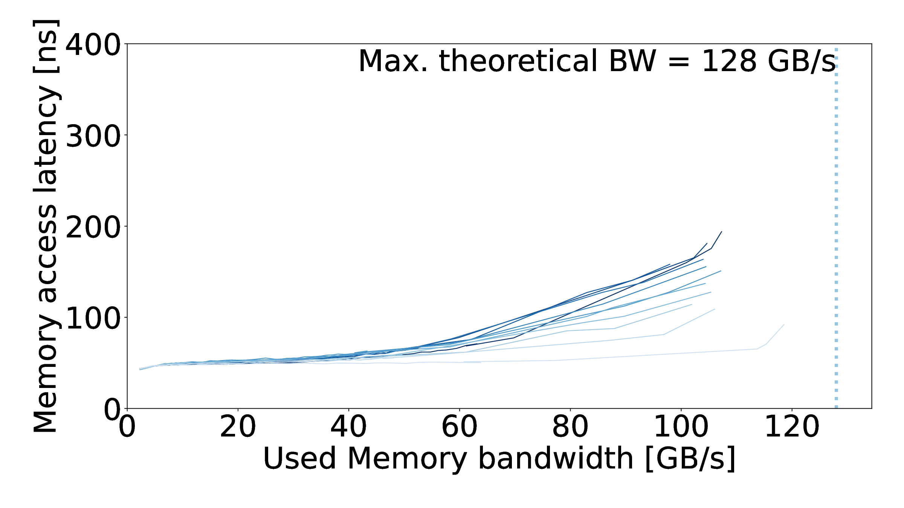 | 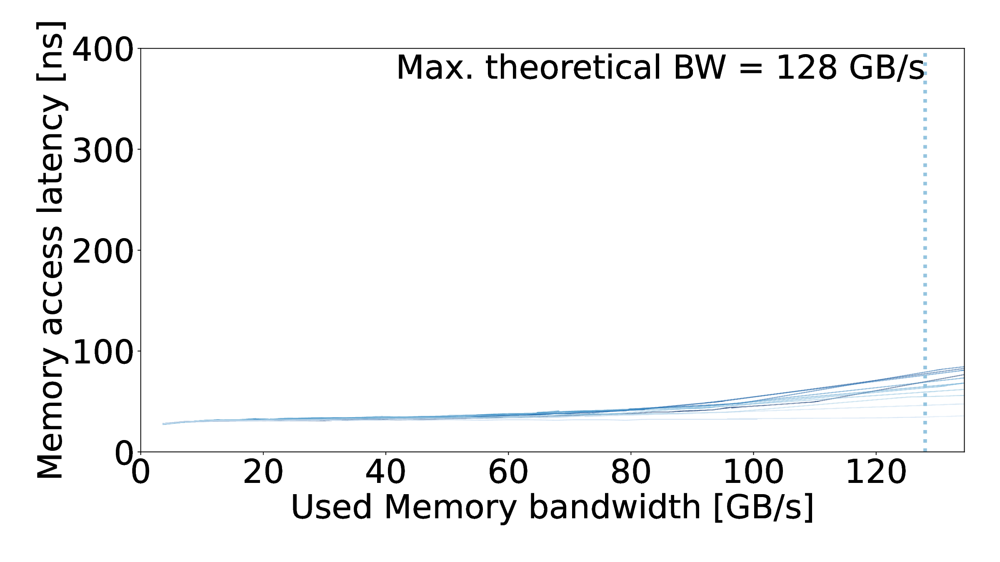 | 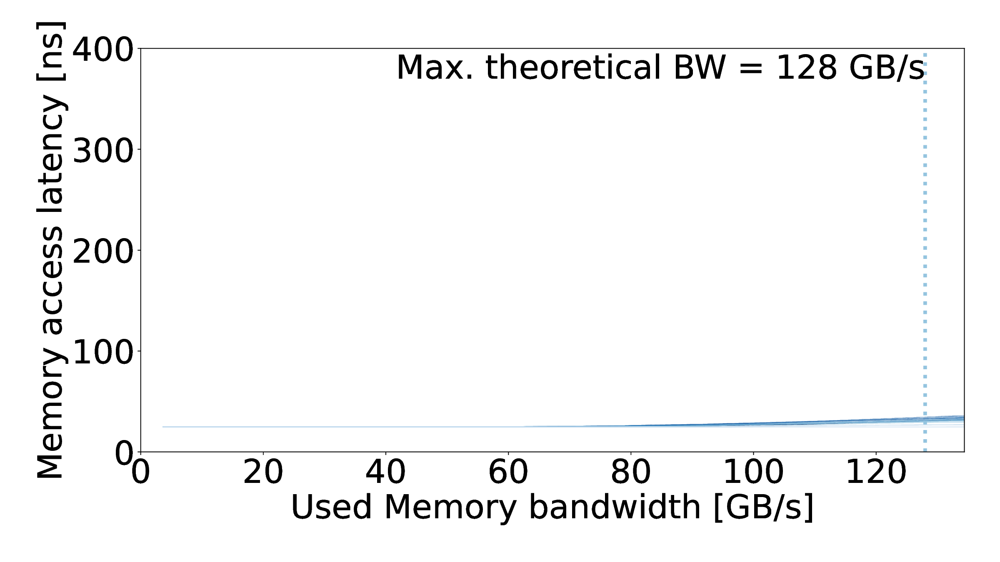 |

### `02-memory-model`

Paper figure: Figure 6  

| Memory simulator view | Memory interface view | Application view |
|:---:|:---:|:---:|
| Results omitted in this snapshot | Results omitted in this snapshot | Results omitted in this snapshot |

### `03-clock-scaling`

Paper figure: Figure 7  

| Memory simulator view | Memory interface view | Application view |
|:---:|:---:|:---:|
| Results omitted in this snapshot | Results omitted in this snapshot | Results omitted in this snapshot |

### `04-correct-freq`

Paper figure: Figure 8  

| Memory simulator view | Memory interface view | Application view |
|:---:|:---:|:---:|
| Results omitted in this snapshot | Results omitted in this snapshot | Results omitted in this snapshot |

### `05-address-mapping`

Paper figure: Figure 9a  
| Memory simulator view | Memory interface view | Application view |
|:---:|:---:|:---:|
| 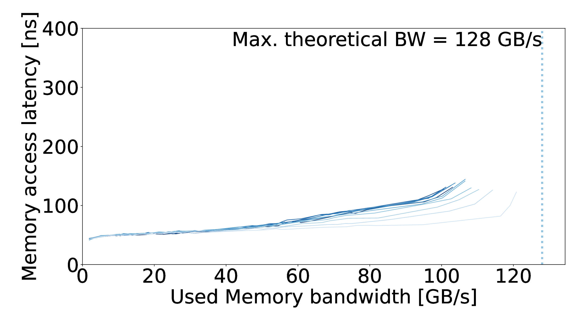 | 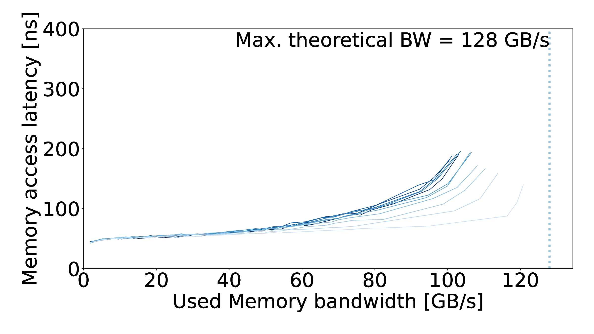 | 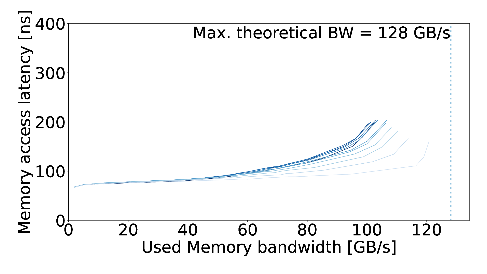 |

### `06-noc`

Paper figure: Figure 9b  
| Memory simulator view | Memory interface view | Application view |
|:---:|:---:|:---:|
| 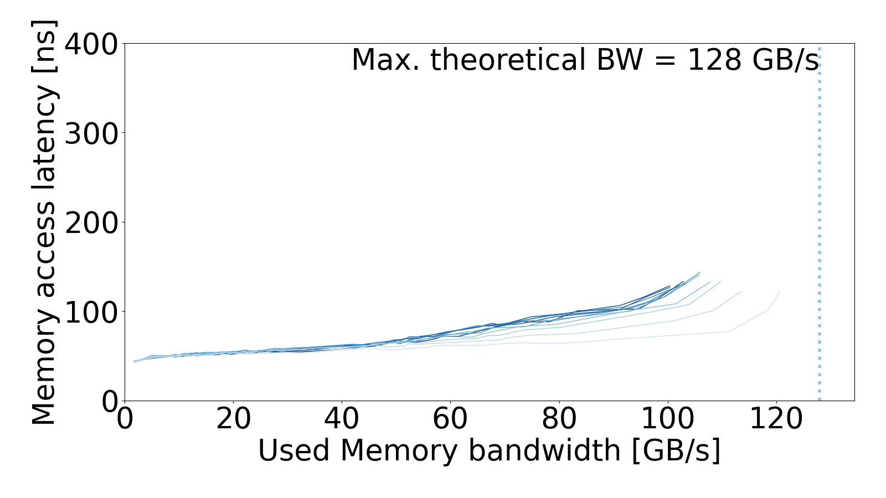 |  | 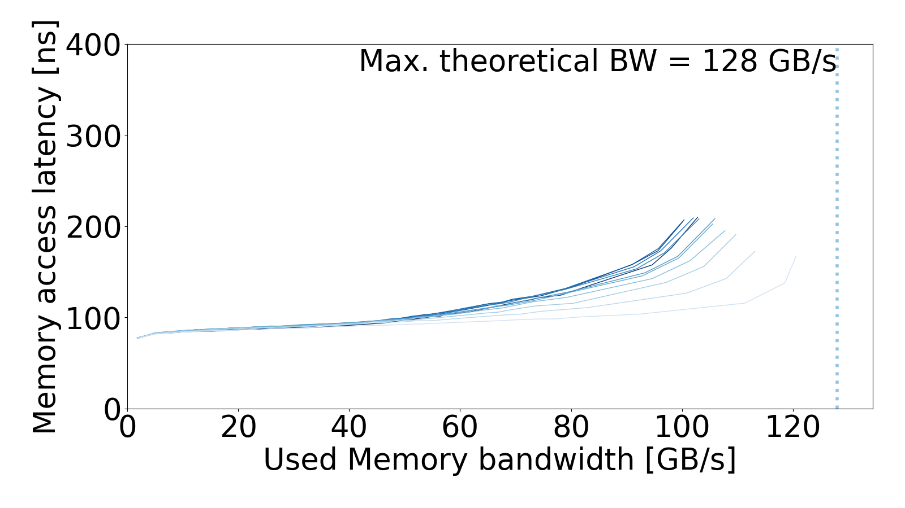 |

### `07-prefetcher`

Paper figure: Figure 9c  
| Memory simulator view | Memory interface view | Application view |
|:---:|:---:|:---:|
| 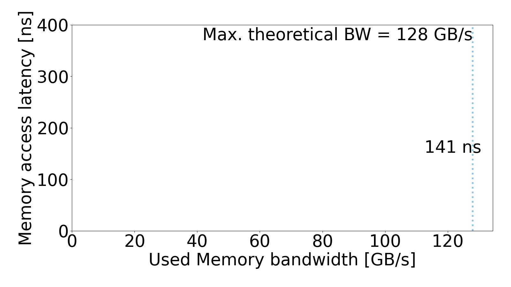 | 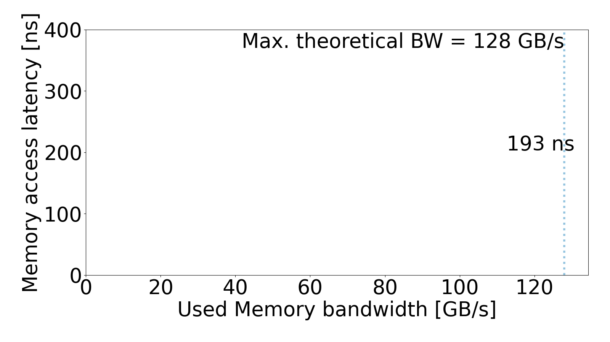 | 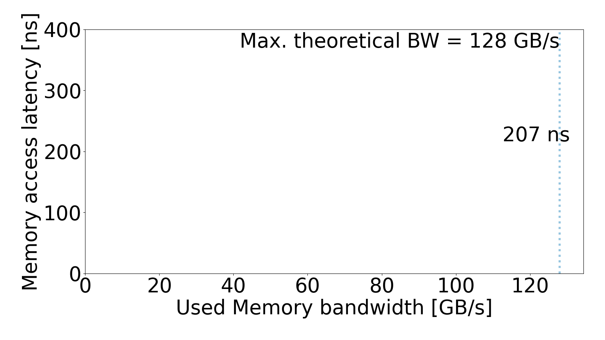 |

### `08-portability-ramulator2`

Paper figure: Figure 10b  
Committed views: memory interface and application  
| Memory interface view | Application view |
|:---:|:---:|
| 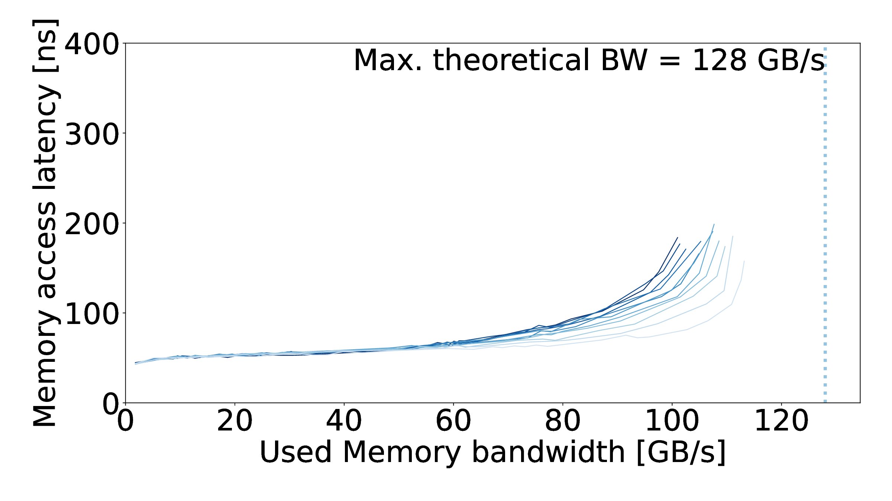 | 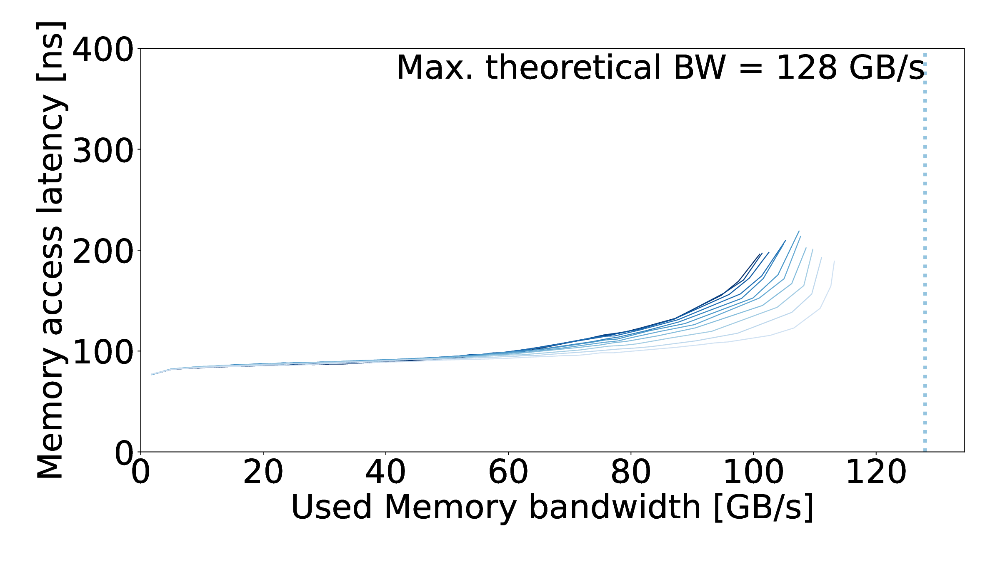 |

### `09-portability-dramsim3`

Paper figure: Figure 10c  
Committed views: memory interface and application  
| Memory interface view | Application view |
|:---:|:---:|
| 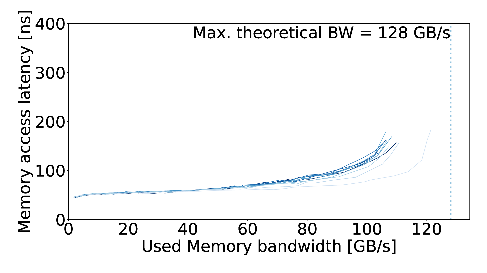 | 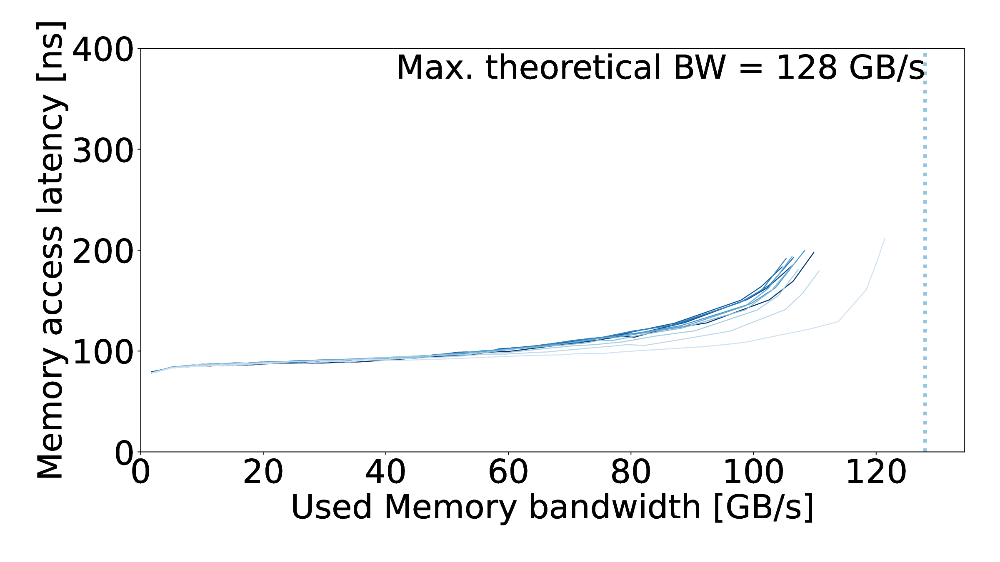 |

### `10-portability-dramsys`

Paper figure: Figure 10d  
Committed views: configuration only in this snapshot.

### `11-mem-intensive`

Paper figure: extension  
Reserved stage. Raw results will be linked here if this stage is released.
